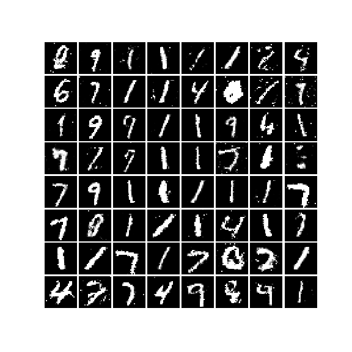
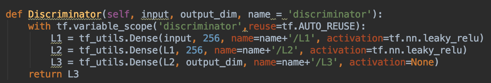
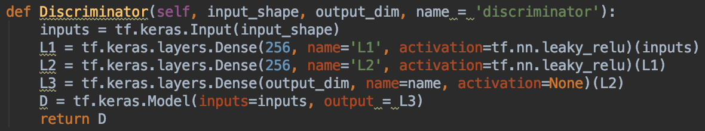
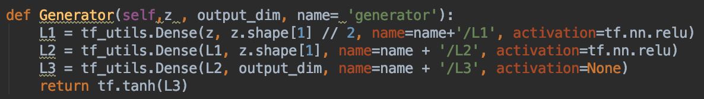
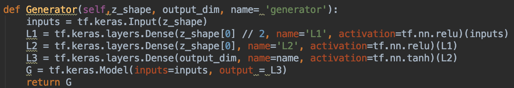
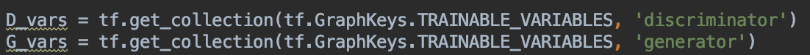
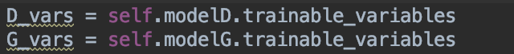
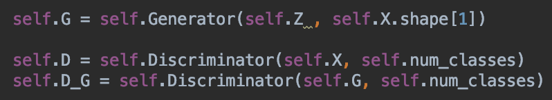
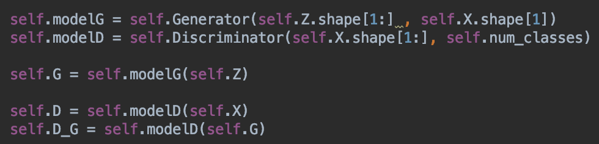

GAN(Generative Adversarial Network) Tour
========================================
* This repository is deal with Vanilla GAN for compare tf1.x vs tf2.x

## Vanilla GAN
* paper : https://arxiv.org/abs/1406.2661
* see : Newtwork.GAN.GAN(v1.x),  Networ.GAN.GANv2(v2.x)
* 

## remarkable features ( upside : v1 downside : v2 )
    1. discriminator

----------------------------------

    2. generator

----------------------------------

    3. get_tainable_vars

----------------------------------

    4. model_define

----------------------------------

## see also :
        https://github.com/jason9693/GAN